# Hello DES INV 202 Student!
Welcome to your new GitHub repository! 

# Outline
[week 1](README.md#week-1-example-report-1)

[week 2](README.md#week-2)

[week 3](README.md#week-3)

[week 4](README.md#week-4)

[week 5](README.md#week-5)

[week 6](README.md#week-6)

[week 7](README.md#week-7)

[week 8](README.md#week-8)

[week 9](README.md#week-9)

[week 10](README.md#week-10)

 
---

# Week 10 #
### October 31st, 2024 ###

It is Thursday, this week has been a little relaxed since we just finished our project. I have been thinking of using my bluetooth keyboard project for my TDF final project. Jeff mentioned that there are some minimum requirements so I am waiting for them to be anounced so that I can finalise what I want to do with my keyboard. I am really excited to work on AI as well. RAG is a really interesting project. I tried a few flows yesterday on zerowidth.
 
 
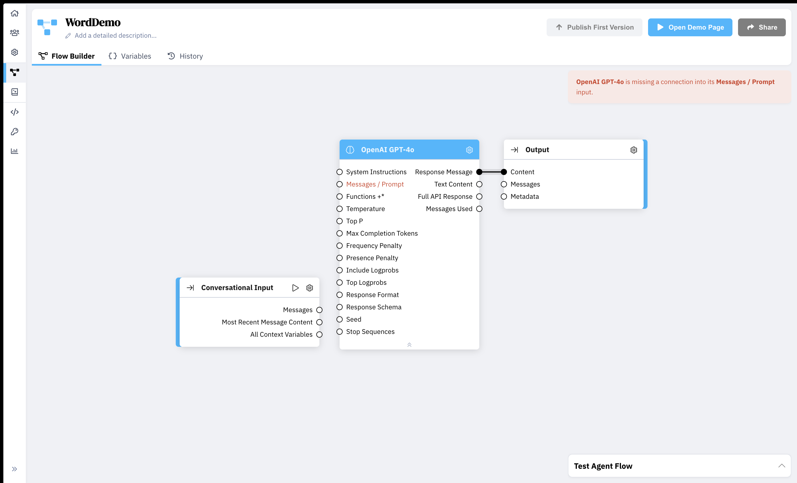
 
 
 

# Week 9 #
### October 24th, 2024 ###

It is Thursday, I went home at 1 am last night because I was working on the TDF Project 2 video. I am pretty happy with how the project turned out. For the project requirements we had to add a lot of circuitry which is not actually required for the purpose of replicating a remembrall. I am really proud that my team has decided to refine the project to make a finished version for our portfolios. I have also been working on my personal project which is the micro board. I have added an image of the latest 3d model here. I decided not to go with the OLED dispay to save space and have better battery performance. Instead of the display, I am going forward with using a vertical rotary encoder which will act like a undo/redo knob, along with two touch buttons, one for opening figma and the other for openeing the browser. I will order the remaining electronic components tomorrow. After they arrive, I will move forward with making my PCB.
 
 
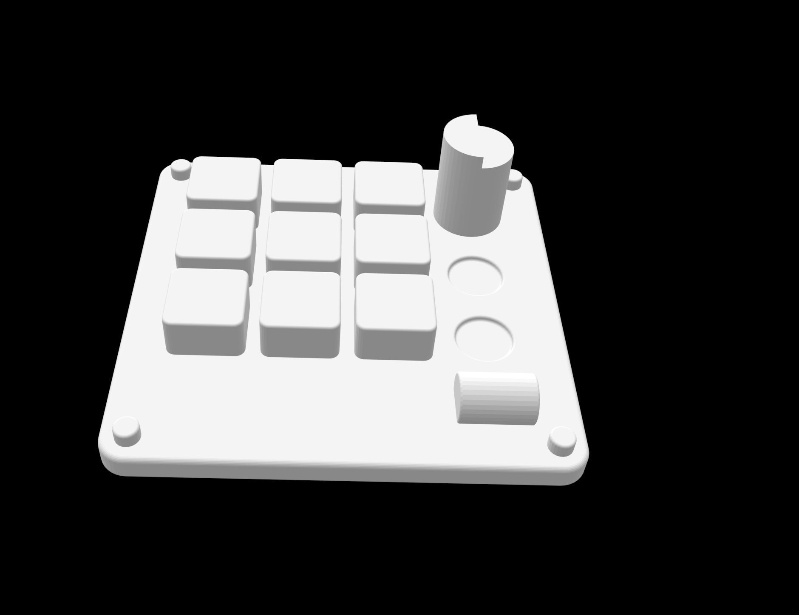
 

 

 
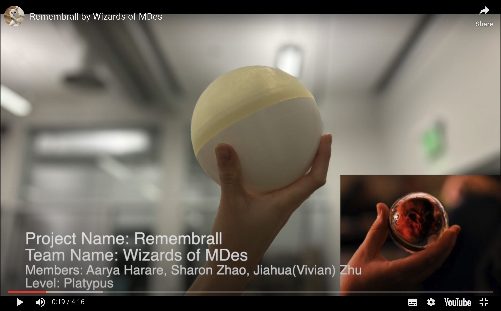
 
 
 

# Week 8 #
### October 17th, 2024 ###

It is Thursday, I have been working on two projects, one is the TDF project for which my team is making a remembrall as mentioned in the last weeks report. We have made a lot of progress on it but are still stuck on the google cloud integration. Today I will make the final stacked circuit using prototyping boards and soldering all the wires and boards in a stack to reduce the horizontal dimensions of the circuit to fit in the ball. THe other project that I am working on is a personal project. I am making a customizable micropad with 9 keys, one roller and one oled display. I made a 3d prototype for exploring the dimensions and found that I need to make the key caps larger. I have already made the POC code which allows me to close windows (using the mac shortcut cmd+Q) by pressing the key. I am hoping that by next week I will be able to make a 3x3 keyboard prototype. 
 
 
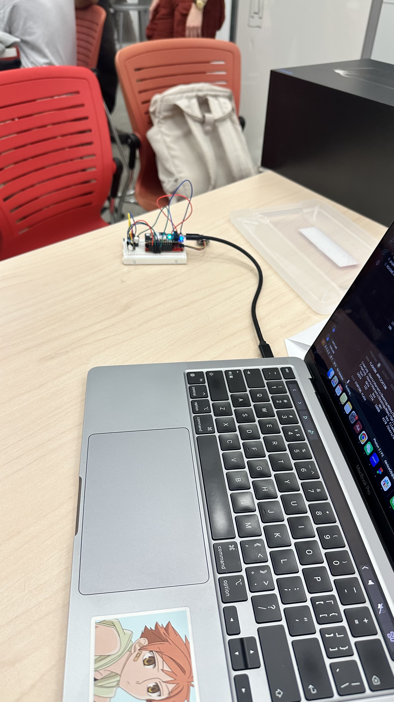
 
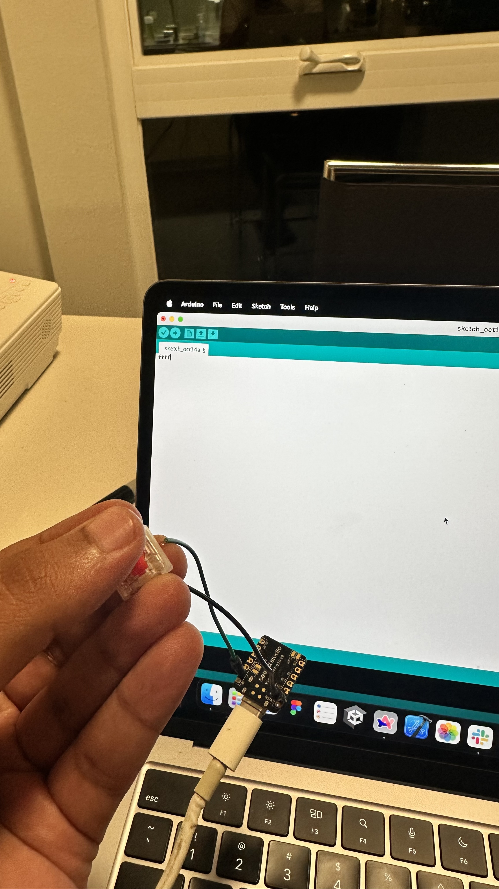
 
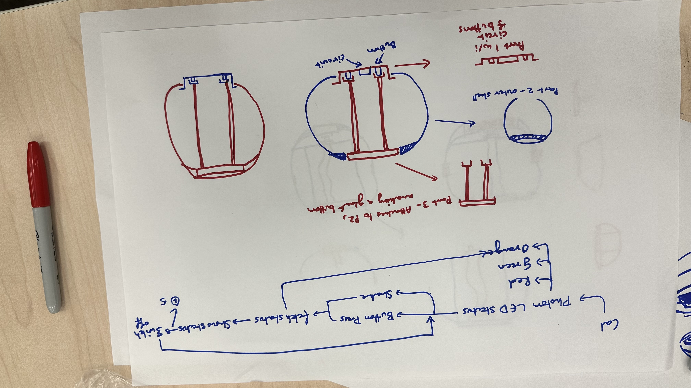

 
 
 

# Week 7 #
### October 10th, 2024 ###

It is Thursday, I was watching harry potter last week, and this week for Studio Foundations we were asked to make an ambient display. I got the idea of making the rememberall ball, essentially a glowing ball that would be connected to google calendar and would shift colours based on whether there is an unpcoming event or not. Me, Sharon and Vivian got together on Tuesday and wrote the project proposal. I drew the system and process diagram while they worked on the text. I am really excited to work on this project. I have also started to work on a personal project of mine which is to create a macro keyboard with programmable keys. I am attempting to make a ergonomic design but the challenge is that perfect ergonomic design looks really bad. Let's see in the coming weeks if I can find a good balance.
 
 
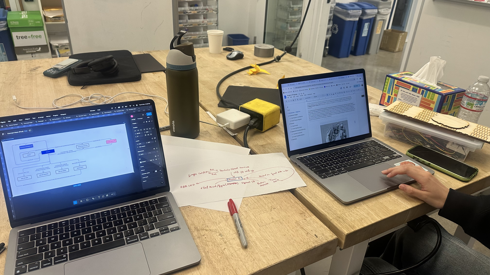

 
 
 

# Week 6 #
### October 3rd, 2024 ###

It is Thursday, I really had fun creating the flashing LED project. I added 4 LEDs which would alternative and added a start/stop function on button press. It looked like christmas and was really fun. Later I did two more project, the first one was the publish/subscribe and FSR/Led colour projects. I ran in an issue after I compiled my code the first time for FSR/Led, everything just stopped compiling and I have no idea why. I will update the solution in the next weeks report.
 
 
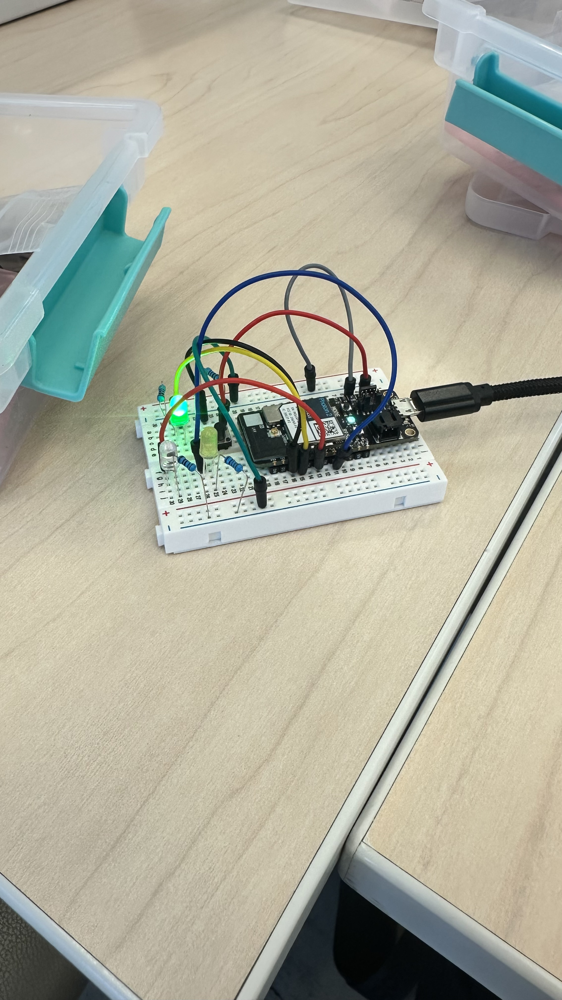
 
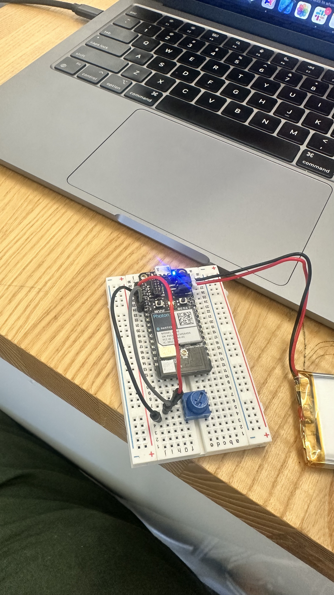
 
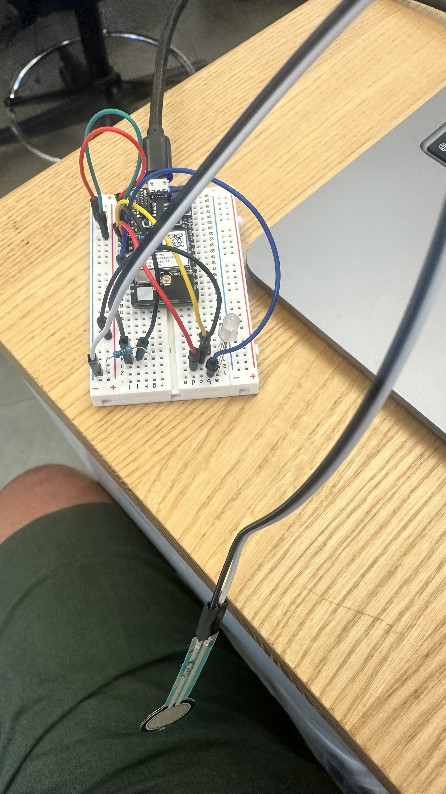

 
 
 

# Week 5 #
### September 26th, 2024 ###

It is THursday, I have created a flowchart of my journey from home to destination using either public transport, walking or uber. The journey consists of data being sent from uber regarding pricing and bart/ac transit sending eta to google. Google claculates total journey time and cost based on all of these variables and shows us on Maps. Based on my preference, I then chose any one of the modes of transportation to reach my destination.
 
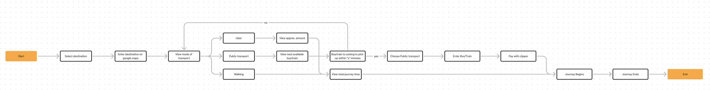

 
 
 

# Week 4 #
### September 19th, 2024 ###

It is monday, I have created my video, here is the link: https://youtu.be/3rTEaj7E28s
I really did not think I could do this in grasshopper, but somehow it worked, took two tries, first tried bruteforce which wasted 2 hours and then used a more nuanced approach. I really loved the problem solving required to use grasshopper.

  

It is wednesday, Grasshopper is a really versatile tool that allows you to build scalable design. P.S. since I finished the video so early I havent really done anything since monday. I need to make the plant holder again because it has been drooping from the weght of the plant, I did not add any triangle support for the edge. 
  

It is Thursday and my earlier plant holder project is drooping, so I refined the design and add supports and made it bridge stronger. 

 

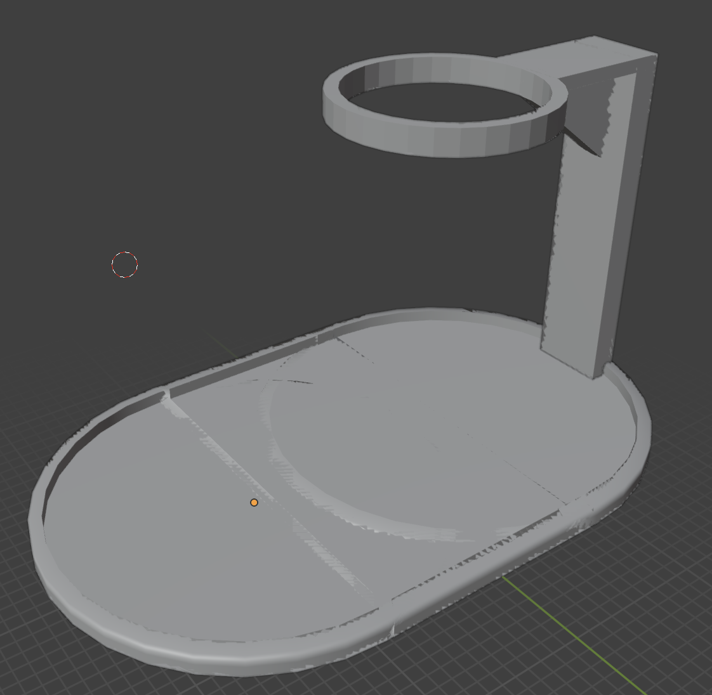
 
 
 

# Week 3 #
### September 12th, 2024 ###
It's Wednesday, I am watching grasshopper youtube videos and have made this shape. I understood the fundamentals and how operations work. 
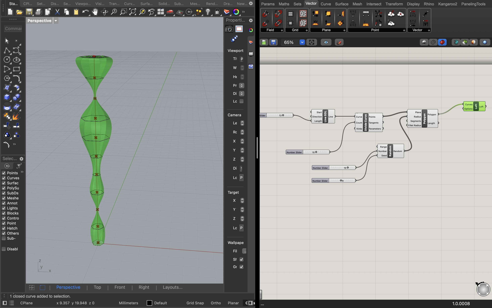
 
I also made a 3d model for the mobile stand so that i dont have to attach the two legs separately. The design allows e to attach my phone while the stand is horizontal and then prop it up. I didn't realise I could do this until Chris Myers pointed it out. 
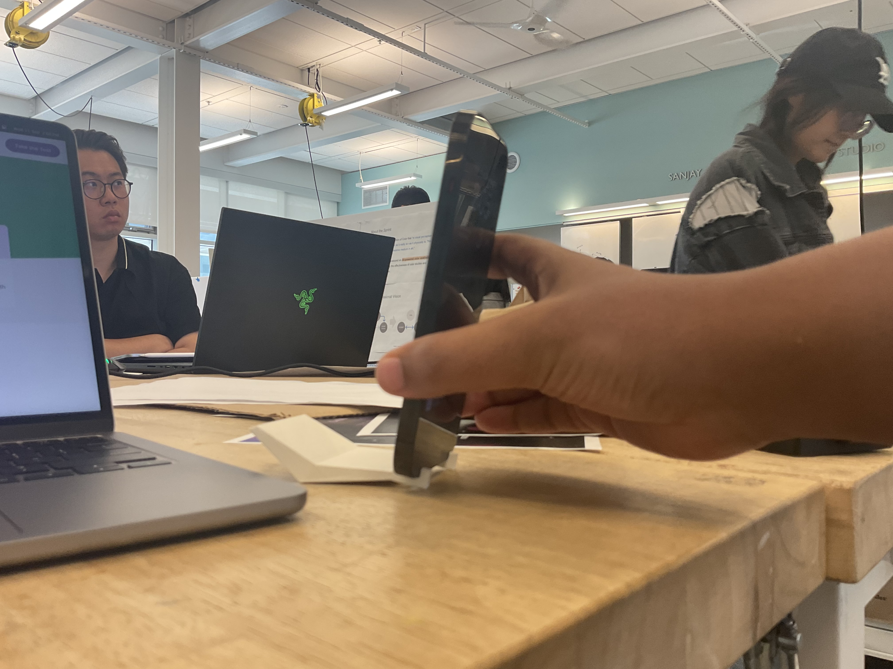

 
I worked on creating the diagram for the grasshopper file for the mobile phone.  
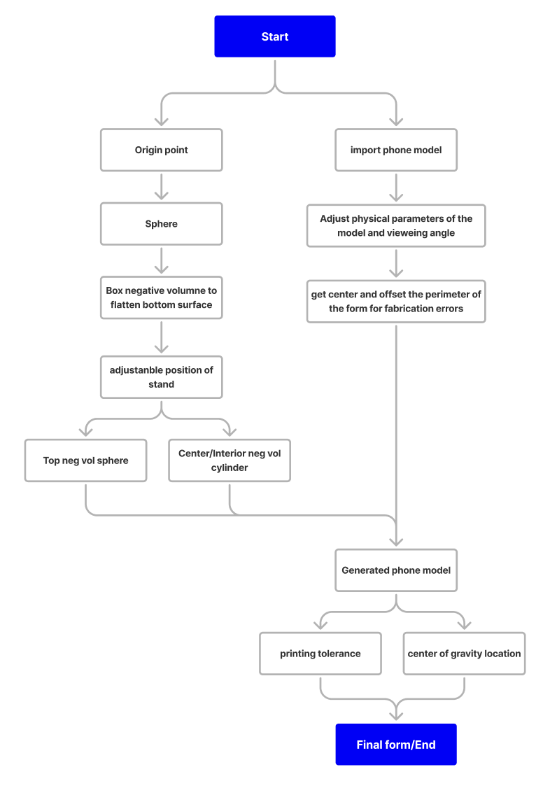
 

It's Tuesday, I am sitting in the MDes studio waiting for my plant stand 3d print while I am trying to sketch ideas for the phone stand. I made a rough prototype using figma and laser cut 0.25" wood to make it. It somehow works Lol. If I poke the phone (try to use the touch screen) it wobbles and might fall. It also doesnt work in landscape mode.

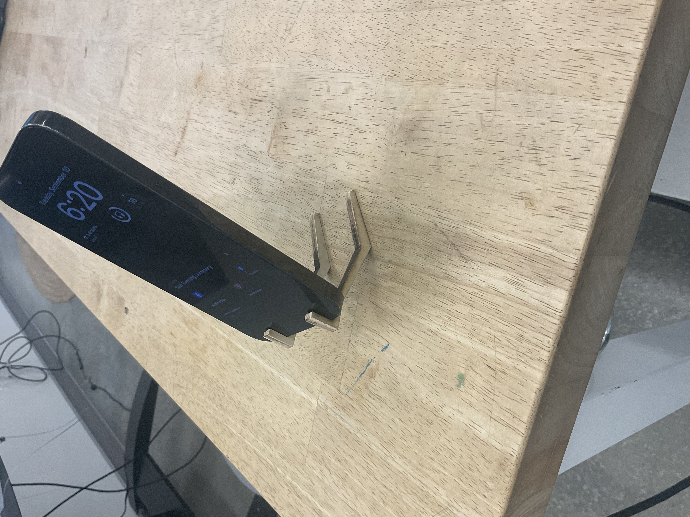
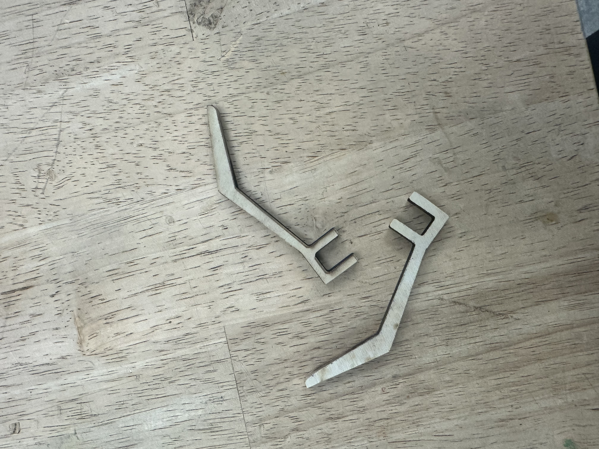
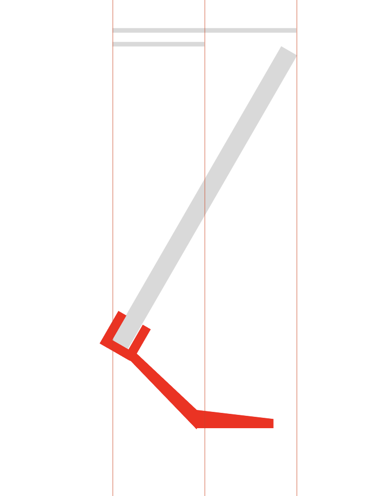
 

It is Monday night and as I was browsing amazon I saw the most amazing laptop stand I have ever seen. I am thinking of making a phone stand like this that works on the principles of balance and center of mass rather than a solid block with a line carved out to keep the phone.

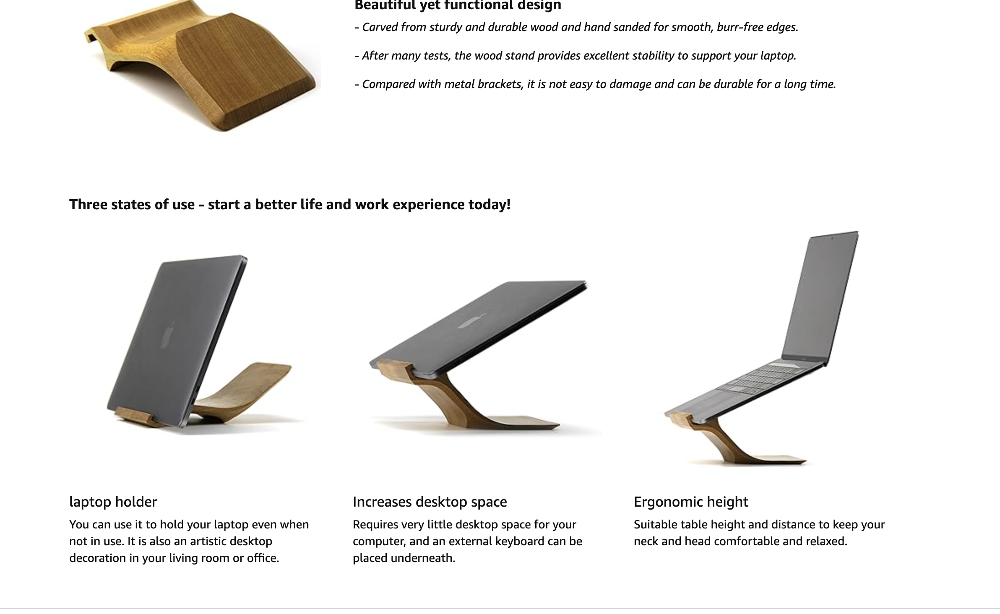
 

I tried grasshopper over the weekend. I was had used Fusion in college but never knew that design could be encoded in such a workflow. I found it fascinating. I love automation and love making block diagrams. This method of using logical flows to breakdown components of designs essentially means that the design will always work (functionally) if the parameters are entered correctly. I am more interested in AR/VR and UI/UX design, but have to admit that I did find the use of workflows in physical design quite fascinating. Don't know if I would want to master grasshopper, but I would deffinetely want to explore more. I have added a few screenshots below where I tried using a cone for the inner shape of the stand. I also tried changing the outer shape from cylinder to sphere but that didn't work and I dont know why yet.

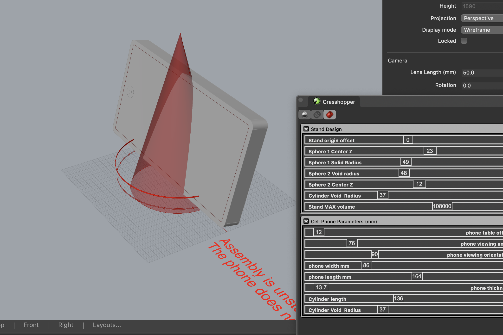
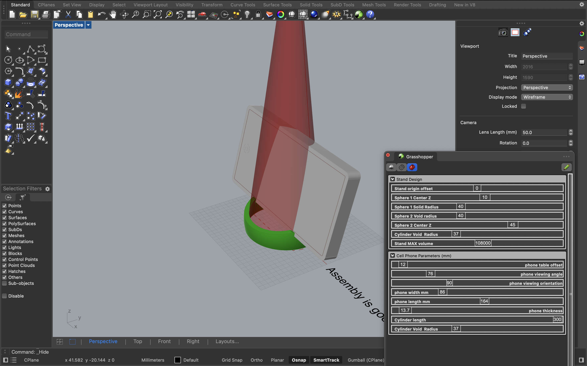

---

# Week 2 #
### September 5th, 2024 ###

This week I learned how to laser print. I spent almost an hour printing the same design 4 times. Initally I had issues with my design not being recognized as cutable even with red and 0.01 stroke(pro tip: import filled svg and then add stroke to it). The first two designs didnt cut through and the third one broke. So I increased the material width in settings and changed the design a bit to increase thickness in thin areas and viola got the third design perfectly. I wanted to make a Cal keychain because the Cal merchendise is typically very expensive to purchase. I am confident, given a design, I can laser cut with any material in one go quickly. I also helped a friend with her first laser cutting mission.

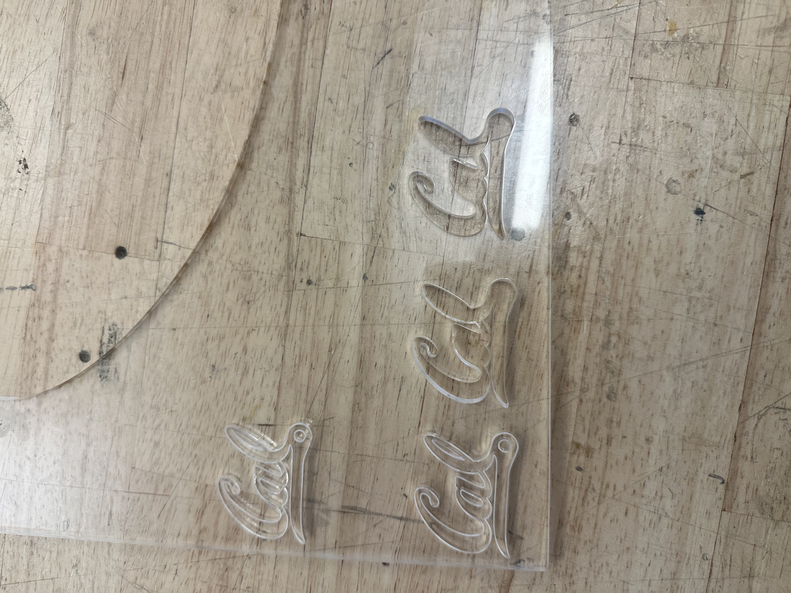

 
 
------------------------------------------------------------------------------------------------------------------------------------------------------------------------------------------------------------------------------------------------------------------------------------------------------------------------------------------------------------------------------------------------------------------------------------------------------------------------------------------------------------------------------------------------------------------------------------------------------------------------------------------------------------------------------------------------------------------------------------------------------------------------------------------------------------------------------------------------------------------------------------------------------------------------------------------------------------------------------------------------------------------------------------------------------------------------------------------------------------------------------------------------------------------------------------------------------------------------------------------------------------------------------------------------------------------------------------------------------------------------------------------------------------------------------------------------------------------------------------------------------------------------------------------------------------------------------------------------------------------------------------------------------------------------------------------------------------------------------------------------------------------------------------------------------------------------------------------------------------------------------------------------------------------------------------------------------------------------------------------------------------------------------------------------------------------------------------------------------------------------------------------------------------------------------------------------------------------------------------------------------------------------------------------------------------------------------------------------------------------------------------------------------------------------------------------------------------------------------------------------------------------------------------------------------------------------------------------------------
 
 
 
 
 

# Github Background Information & Context
If you’re new to GitHub, you can think of this as a shared file space (like a Google Drive folder, or a like a USB drive that’s hosted online.) 

This is your space to store project files, videos, PDFs, notes, images, etc., and (hopefully, neatly) organize so it's easy for viewers (and you!) to navigate. That said, it’s super easy for you to share any file or folder with us (your TDF instructional team) - just send us the link!  As a start, feel free to simply add images to the `/assets` folder, which is located [here](/assets). 

The specific file that I’m typing into right now is the **README.md** for this repo. 
##### (💡 TIP: The .md indicates that we’re using [Markdown formatting.](https://www.markdownguide.org/cheat-sheet/)) #####
<h6> (💡 TIP 2: GitHub Markdown supports <a href="https://gist.github.com/seanh/13a93686bf4c2cb16e658b3cf96807f2"> <em>HTML formatting</em> too, including emojis 😄</a>, in case that helps!) </h6>

### :star: Whatever you write in your **README.md** will show up on the “front page” of your GitHub repo. This is where we’ll be looking for your [weekly progress reports](https://github.com/Berkeley-MDes/24f-desinv-202/wiki/3.0-Weekly-Submissions#weekly-progress-report). They might look something like this: ###

# Week 1: Example Report 1 #
## Week of 09/05/2024

This week, I designed a cool phone stand made of rocks. Check out all my cool sketches and progress photos from this week below, etc., etc....

---

It's time to start making this space your own! If you want to save these instructions, make a copy.  Also, feel empowered to delete everything in this README.md and start documenting! 

Excited to work with you,
your TDF teaching team

PS: let us know if you have any questions!!

PPS: 

## Quick Links, compiled here for your convenience: ##

- [TDF Wiki](https://github.com/Berkeley-MDes/24f-desinv-202/wiki) - the ultimate source for truth and information about the course and assignments
- [Google Drive Folder](https://drive.google.com/drive/u/0/folders/1DJ1b6sSDwHXX6NRcQYt10ivyQSgU0ND6) - slides and other resources
- [bCourses](https://bcourses.berkeley.edu/courses/1537533) - where the grading happens

